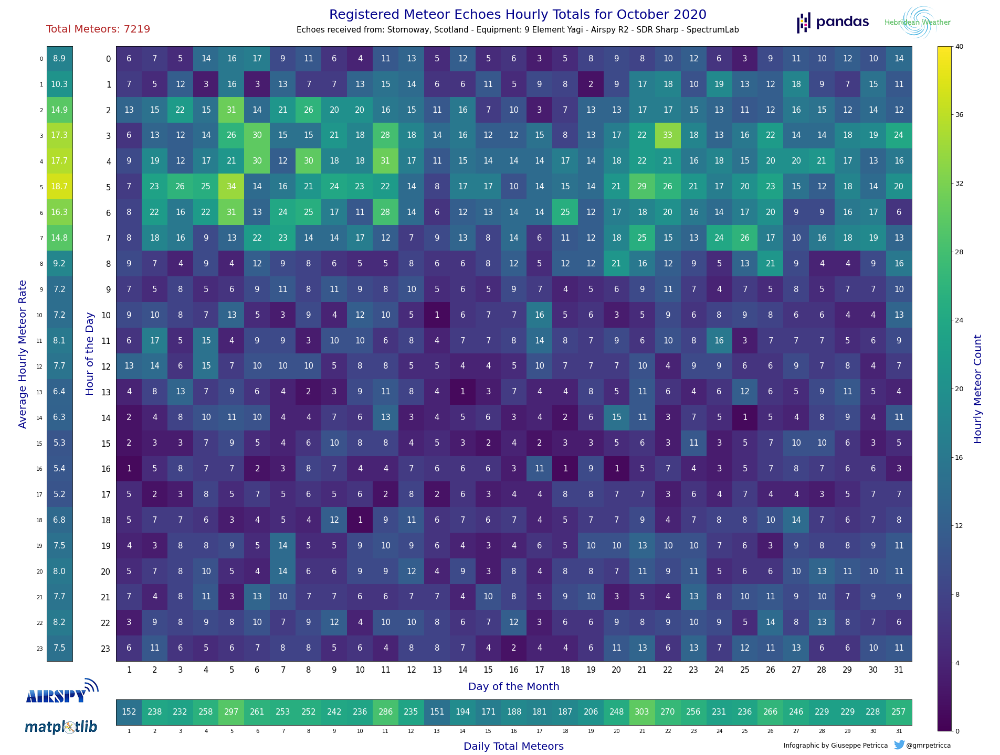

# Meteor Echoes Count
### Read Meteor Echoes hourly totals from a .xlsx file and produce a comprehensive display.

*Coded by Giuseppe Petricca (@gmrpetricca)*

[](https://github.com/raspishake/rsudp/blob/master/LICENSE)

A straightforward script to read already compiled Meteor Echoes hourly data from a `.xlsx` file and then automatically create and save a comprehensive infographic based on the user selected month.



Required software and packages:
- Python 3
- Jupyter
- Matplotlib
- Numpy
- Pandas
- Pillow
- datetime

Installation via Anaconda:
```bash
# install the environment with the correct software:
conda create -n meteorechoes python=3 jupyter matplotlib numpy pandas pillow datetime
# activate the environment
conda activate meteorechoes
# start Jupyter Notebook
jupyter-notebook
```

Once this is done, it is possible to open the `.ipynb` file in the repository. Microsoft Excel is required to open the `.xlsx` file, please keep the two in the same folder.

Regarding the `.xlsx` file, please substitute the `XXXX` part of the name with the current year (or the year of your choice).

The process and file are commented throughout the various steps, however, this is a brief guide on how to use them: 

1. Open the `.xlsx` file and add the Meteor Echoes Hourly data in each cell. The columns are the days of the month, and the rows are the time of the day. Time is always UTC.
2. If there is a `hourly count = 0`, then you can leave it, it will not create problems. However, leave any cells that have still to be filled (i.e. because they are future hours/days) empty, so that the script will color them in a different tone.
3. Once done, save the `.xlsx` file and open the `Meteors.ipynb` file.
4. On `line 15` change the local address of the `.xlsx` file to match the location in which it is on your computer (if they are not in the same folder).
5. Execute the script, and when prompted, insert a number for the desired month to be displayed.
6. At the end of the process an image will be created in the same folder of the `.xlsx` and the `.ipynb` file.

Done!

Extra: if you have one, you can add your personal logo high on the right by putting it in the `img` folder and modifying its address on `lines 198-199` of the the `.ipynb` file.

Note: the script will not print empty months. There has to be at least a single value for the program to use.
